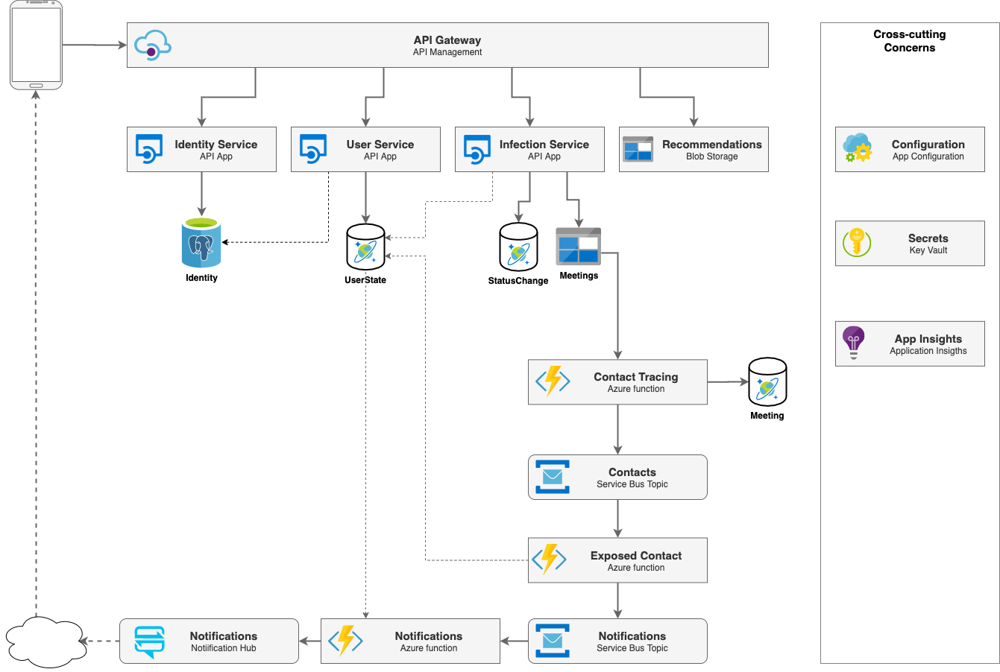

# Covid Resistance Backend Services

COVID Resistance is a digital health identity contact tracing mobile app that anonymously tracks risk exposure to COVID-19. The app, which is GDPR and HIPAA-compliant, uses real-time, anonymous, tokenized data through Bluetooth to alert users if they are at risk of COVID-19 transmission based on their proximity with at-risk or infected users.
Mobile part is represented in [a separate repository](https://github.com/epam/covid-resistance-mobile)

## Cloning Instruction 

```
git clone https://github.com/epam/covid-resistance-back-end.git
```

## Table of Contents

* [Components](#components)
* [Deployment](#deployment)


## Components

CovidResistance is built from a number of interconnected components.



The role and specifics of these components is described in the following chapters:

### API Gateway

The public interface to the backend services, provides endpoints that the mobile application can invoke.
It is implemented in Azure API Management.

It has the following responsibilities:
* Provide a public interface to the private services
* Combine and translate responses and status codes

### Identity Service

Responsible for user authentication and authorization. Manages user names, passwords and roles.
Implemented with IdentityServer4; it is backed by an Azure Database for PostgreSQL server.

[Source Code](src/Services/User/User.IdentityServer)

### User Service

Responsible for user management from business domain point of view:
* Returning user profile
* Managing user state
* Managing push notification tokens

It is backed by the CosmosDB tables with Cassandra API:
* UserState (current state of the user)
* UserStateHistory (all changes in the user state)

[Source Code](src/Services/User)

### Infection Service

Responsible for:
* Initiating an infection process by a medical user
* Accepting an infection change request by a regular user.

It talks to the following data sources:
* *StatusChange:* CosmosDB table, manages the approval codes described in the infection process
* *UserState and UserStateHistory:* CosmosDB tables, used when changing a user's infection state.
* *Meetings:* Blob storage for storing the meeting history of the infected person.

Accepting an infection change request initiates a complex workflow that
* changes the current user's state
* tracks all possibly exposed contacts of the current user
* notifies the users at risk.

These steps however are decoupled by the `Meetings` blob storage, and the responsibility of the
infection service ends when the state of the current user is changed, and the meeting history is saved
to the blob storage.

[Source Code](src/Services/Infection/Infection.WebApi)

### Contact Tracing

Implemented as an Azure function, it is triggered when a new meeting history appears in the blob storage.
The service is responsible for:
* Identifying the users who were in contact with the infected person within the specified time period.
* Sending a message to the `Contacts` service bus topic for each identified user.
* Saving the meetings to the CosmosDB table `Meetings`.

[Source Code](src/Services/Infection/Infection.FnApp)

### Exposed Contact

Implemented as an Azure function, it is triggered for each new message in the 
`Contacts` service bus topic.
It is responsible for:
* Changing the user state of the identified user
* Send a message to the `Notifications` service bus topic

[Source Code](src/Services/Infection/Infection.FnApp)

### Notifications

Implemented as an Azure function, it is triggered when a new message arrives to the `Notifications`
service bus topic. It is responsible for
* Sending push notifications to the affected user.

[Source code](src/Services/Notification)

### Configurations and Secrets

Configurations are stored in the App Configuration service, which is used by multiple services.
Secrets (like connection strings and database passwords) are stored in a Key Vault, and they
are linked to the App Configuration.

## Deployment

### Customization

Before deploying the application we recommend to supply your own
shared secret instead of the placeholder found in the code.

Please follow the next steps:
* Generate a secure password-like secret
* Replace the "secret" placeholder when assigning it to the `$secret` variable in the [DeployEnvironment.ps1](deployment/Infrastructure/DeployEnvironment.ps1)
* Replace the "secret" placeholders in [Config.cs](src/Services/User/User.IdentityServer/Config.cs)

### Prerequisites

* Install [Azure CLI](https://docs.microsoft.com/en-us/cli/azure/install-azure-cli?view=azure-cli-latest)
* Install [Azure Powershell](https://docs.microsoft.com/en-us/powershell/azure/install-az-ps)
* Install Azure CLI extensions:

```bash
az extension add --name db-up
az extension add --name notification-hub
az extension add --name application-insights
```

* Get an [APNs certificate from Apple](https://developer.apple.com/documentation/usernotifications/setting_up_a_remote_notification_server/establishing_a_certificate-based_connection_to_apns).

### Authentication

```bash
# Go to the infrastructure subfolder
cd deployment/Infrastructure

# Login to Azure CLI
az login

# Select your subscription
az account list # observe the id of the proper subscription
az account set --subscription ${id}

# Login to Azure Powershell
Connect-AzAccount

# Select your subscription
Select-AzSubscription -SubscriptionId ${id}
```

### Deploy Infrastructure

When deploying a new infrastructure, the following parameters can be specified:
* product: The name of the product, it will appear in all resource names.
* environment: The name of the environment
* settingsKey: [Settings file name](deployment/Infrastructure/settings) without extension. Optional, defaults to `dev`.

The `product` and `environment` arguments are mandatory: they will be asked for if not supplied.

#### Settings

The settings file contains a number of mandatory arguments. It is recommended to create and use a new copy,
and adjust the settings based on your needs.

* **PostgreSQL SKU:** Select the [right size for your database](https://docs.microsoft.com/en-us/azure/postgresql/quickstart-create-server-database-azure-cli#create-an-azure-database-for-postgresql-server).
* **APNs certificate:** Provide a valid path to your certificate and a text file containing the passcode.

```bash
# Deploy service components
./DeployEnvironment.ps1 -product epmcovi -environment mvp2 -settingsKey mvp

# Update API Management policies
./Import-APIMgmtPolicies -product epmcovi -environment mvp2 -settingsKey mvp
```

### Build and Deploy Artifacts (CI/CD)

This step is about setting up the CI/CD pipelines that deploy the code changes to the previously created environments.

Configuring a CI/CD pipeline depends on the specifics of the infrastructure and branching strategies.
Az example pipeline for [Azure DevOps](https://azure.microsoft.com/en-us/services/devops/) is available in the
[deployment/azure-devops](deployment/azure-devops) folder. It can be imported to Azure DevOps on the
Pipeline page.

## License Information

Licensed under Apache 2.0, [LICENSE](LICENSE)
